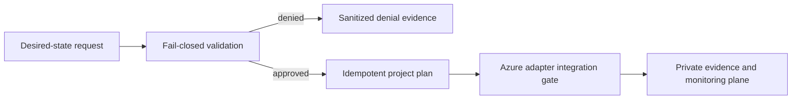

# AKS-FIPS-AzureLinux-Baseline

Create an auditable AKS baseline for workloads that require FIPS-enabled Azure Linux nodes.

## Example synopsis

A regulated-cluster request validates FIPS-enabled Azure Linux pools, private API access, workload identity, policy controls, and approved production scope before deployment planning.

## Real-world scenario

A public-sector workload needs evidence that its Kubernetes worker nodes use approved cryptographic modules and hardened settings. The baseline packages those requirements into a reproducible AKS design instead of a manual build checklist.

## Architecture

IaC deploys private AKS with isolated FIPS node pools, approved images and crypto settings, Azure Policy controls, vulnerability monitoring, controlled egress, and evidence scripts mapping settings to CIS and regulatory expectations.

Primary services: `AKS`, `Azure Linux`, `Azure Policy`, `Azure Monitor`, `Defender for Containers`.

This repository implements the first production-oriented vertical slice: a
fail-closed, adapter-neutral control plane that validates tenant scope,
freshness, approvals, secretless identity, private access, and the exact
project action before producing a deterministic execution plan. Azure adapters
consume that plan; they are deliberately outside the local simulator so local
tests cannot claim a live cloud change occurred.



## Quickstart

Requirements: Python 3.11+ and Git. No Azure credentials are required.

```bash
./scripts/validate.sh
python3 src/control_plane.py --request examples/approved-request.json
```

The command emits canonical JSON with a stable idempotency key. The denied
fixture exits with status 2 and explains the failed invariants.

## Security boundaries

- Managed identity or workload identity only; embedded credentials are denied.
- Public network access and stale evidence are denied.
- Production and break-glass targets require explicit approval.
- The IaC entry point is opt-in and defaults to deploying nothing.
- Evidence output contains identifiers and decisions, never credential values.

## Verification and limitations

Local validation covers 13 tests, deterministic replay, JSON parsing, Python
compilation, ignore hygiene, and Bicep compilation when a compiler is present.
It does **not** prove Azure deployment, service licensing, quota, data-plane
permissions, provider/API availability, cloud failover, load, cost, or teardown.
See [[`docs/test-matrix.md`](docs/test-matrix.md)](docs/test-matrix.md) and [[`docs/runbook.md`](docs/runbook.md)](docs/runbook.md) before any integration trial.

## Community

See [[`CONTRIBUTING.md`](CONTRIBUTING.md)](CONTRIBUTING.md), [[`SECURITY.md`](SECURITY.md)](SECURITY.md), [[`SUPPORT.md`](SUPPORT.md)](SUPPORT.md), and [[`LICENSE`](LICENSE)](LICENSE). The reference
is intentionally conservative and uses synthetic identifiers only.

## Repository guide

- [Architecture](docs/architecture.md)
- [Threat model](docs/threat-model.md)
- [Operations runbook](docs/runbook.md)
- [Test matrix](docs/test-matrix.md)
- [Cost model](docs/cost-model.md)
- [Security policy](SECURITY.md)
- [Contributing guide](CONTRIBUTING.md)
- [Support policy](SUPPORT.md)
- [Changelog](CHANGELOG.md)
- [License](LICENSE)
